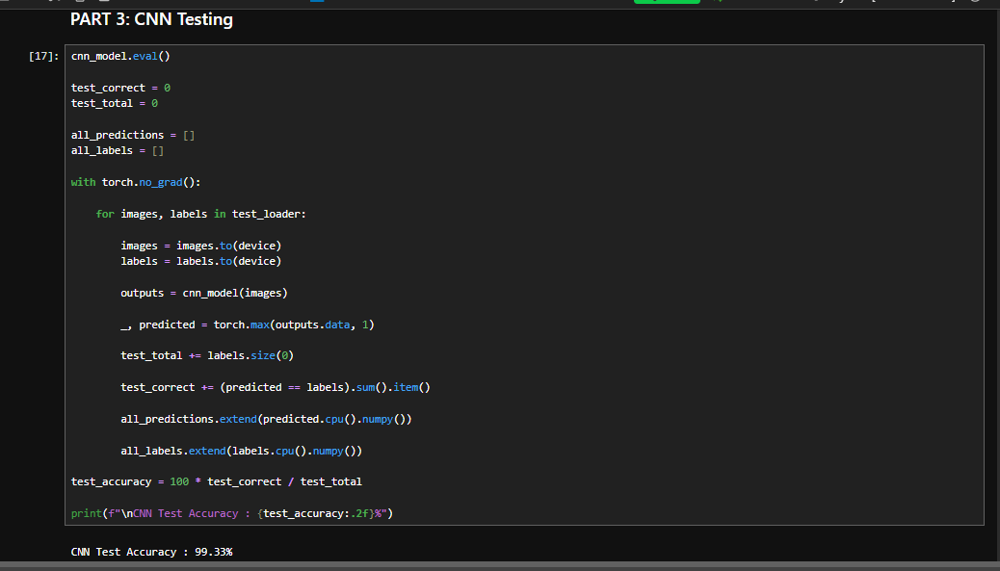
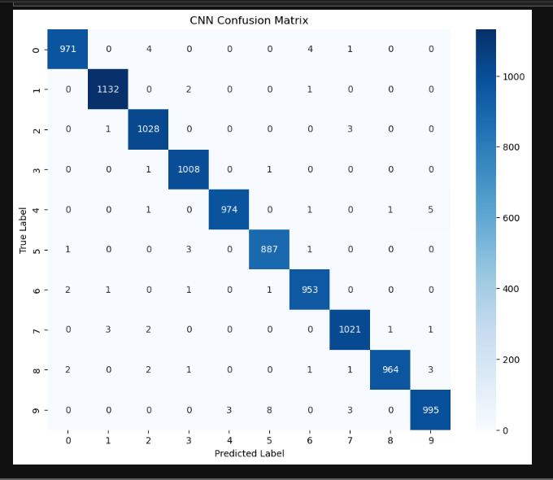
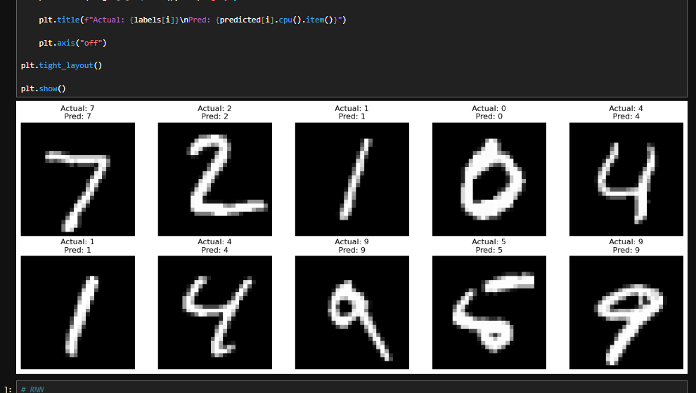
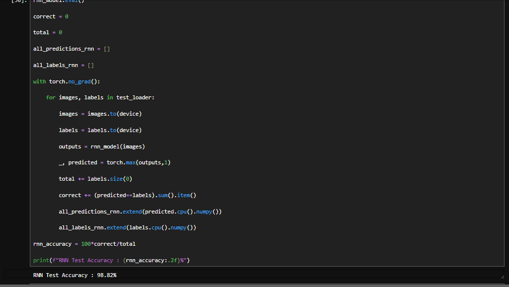
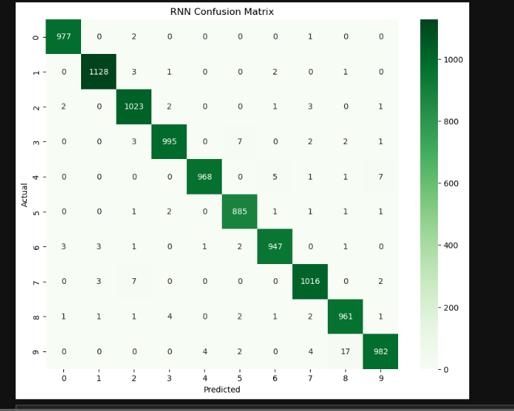
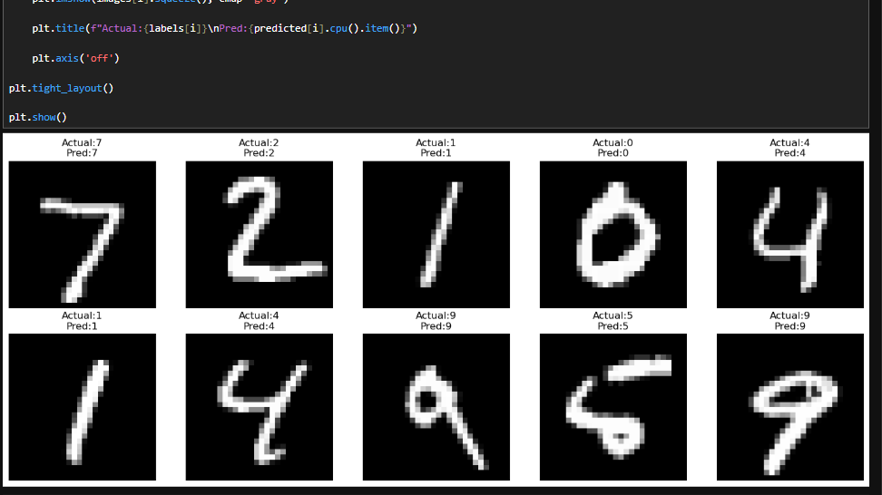
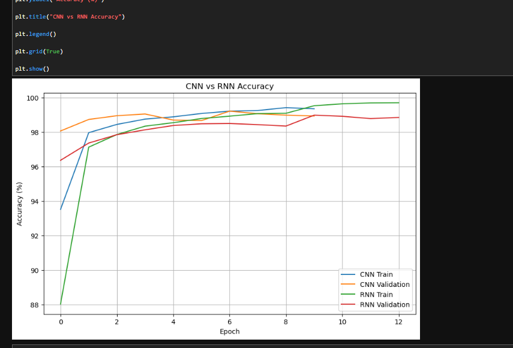
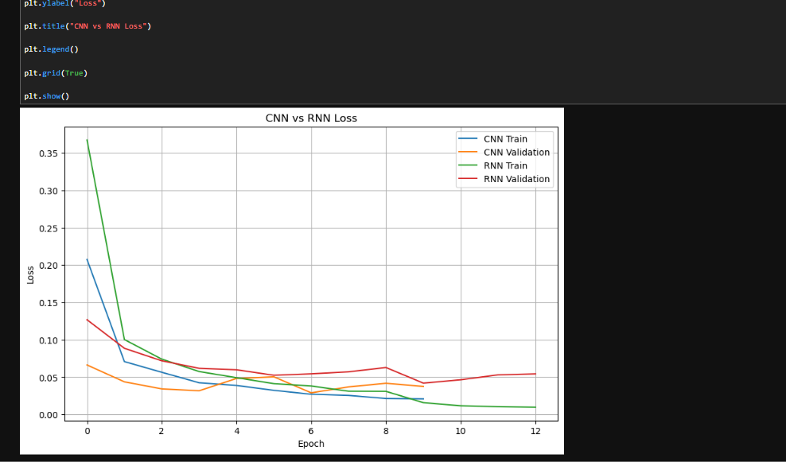
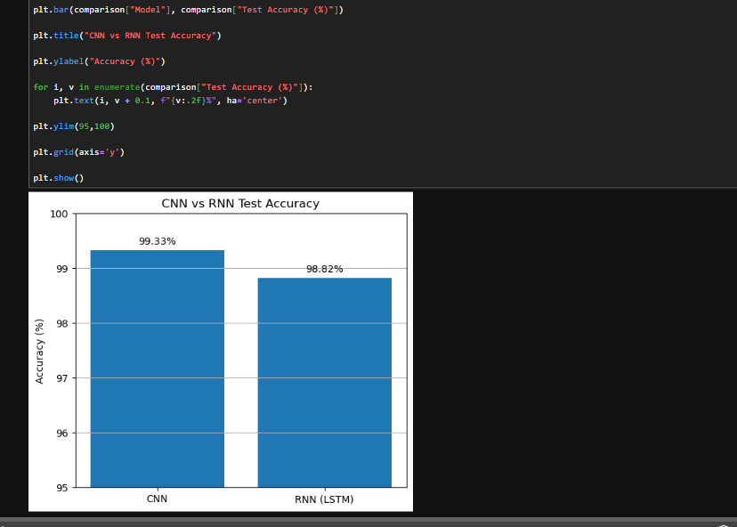

# Handwritten Digit Classification using CNN & LSTM

## 📌 Project Overview

This project implements and compares two deep learning approaches for handwritten digit classification using the MNIST dataset:

- Convolutional Neural Network (CNN)
- Long Short-Term Memory (LSTM) based Recurrent Neural Network (RNN)

The models were developed using PyTorch and evaluated using accuracy, precision, recall, F1-score, confusion matrices, and training/validation performance curves.

The project demonstrates how CNN and LSTM architectures can be applied to handwritten image classification and compares their performance on the same dataset.

---

## 🎯 Objective

The main objective of this project is to build deep learning models capable of recognizing handwritten digits from 0 to 9 and compare the performance of CNN and LSTM-based RNN architectures.

The expected outcome of the project was a trained CNN and RNN model capable of achieving high classification accuracy, typically greater than 95%.

---

## 📊 Dataset

The project uses the MNIST handwritten digit dataset available through `torchvision.datasets.MNIST`.

### Dataset Details

- Training images: 60,000
- Test images: 10,000
- Image size: 28 × 28 pixels
- Number of classes: 10
- Classes: 0–9
- Image type: Grayscale

The dataset is automatically downloaded when the notebook is executed.

---

## 🛠️ Technologies Used

- Python
- PyTorch
- Torchvision
- NumPy
- Pandas
- Matplotlib
- Seaborn
- Scikit-learn
- Jupyter Notebook

---

## 🧠 Models Implemented

### 1. Convolutional Neural Network (CNN)

The CNN model consists of:

- Convolutional layers
- Batch Normalization
- ReLU activation
- Max Pooling
- Fully Connected layers
- Dropout

The CNN is designed to extract spatial features from handwritten digit images such as edges, curves, and shapes.

### 2. LSTM-based Recurrent Neural Network (RNN)

The LSTM model treats each 28 × 28 image as a sequence of 28 rows, where each row contains 28 pixel values.

The sequence is processed by an LSTM network followed by fully connected layers for classification.

This approach allows the RNN to learn patterns from the sequential representation of the image.

---

## ⚙️ Data Preprocessing

The following preprocessing steps were performed:

1. Convert images to PyTorch tensors.
2. Normalize image pixel values.
3. Split the training data into training and validation sets.
4. Create DataLoaders for batch-based training.
5. Prepare the image data according to the input requirements of the CNN and LSTM models.

---

## 🔬 Training Techniques

The following techniques were used:

- Adam optimizer
- Cross-Entropy Loss
- Batch Normalization
- Dropout regularization
- Learning Rate Scheduler
- Early Stopping
- GPU acceleration when available

These techniques were used to improve model training, convergence, generalization, and overall performance.

---

## 📈 Results

| Model | Test Accuracy |
|---|---:|
| CNN | **99.33%** |
| LSTM (RNN) | **98.82%** |

Both models achieved significantly higher than the required 95% accuracy.

The CNN achieved the best performance with a test accuracy of **99.33%**, while the LSTM-based RNN achieved **98.82%**.

---

## 📊 Model Evaluation

The models were evaluated using:

- Accuracy
- Precision
- Recall
- F1-score
- Confusion Matrix
- Training Loss
- Validation Loss
- Training Accuracy
- Validation Accuracy

These evaluation metrics were used to understand the classification performance and compare the two deep learning architectures.

---

## 📷 Results Visualization

### CNN Accuracy



### CNN Confusion Matrix



### CNN Sample Predictions



### RNN Accuracy



### RNN Confusion Matrix



### RNN Sample Predictions



### CNN vs RNN Accuracy



### CNN vs RNN Loss



### Model Comparison



---

## 🔍 Key Findings

The CNN achieved **99.33% test accuracy**, while the LSTM-based RNN achieved **98.82% test accuracy**.

Both models successfully exceeded the required 95% accuracy target.

The CNN performed better because convolutional neural networks are specifically designed to learn spatial features from image data. The convolutional layers can effectively learn features such as edges, curves, and shapes that are important for handwritten digit recognition.

The LSTM-based RNN also achieved high accuracy by processing each image as a sequence of rows. However, LSTM networks are primarily designed for sequential data and do not naturally capture two-dimensional spatial relationships as effectively as CNNs.

Therefore, CNN performed better for this handwritten image classification task.

---

## 📊 CNN vs RNN Performance

| Model | Architecture | Test Accuracy |
|---|---|---:|
| CNN | Convolutional Neural Network | **99.33%** |
| LSTM | LSTM-based Recurrent Neural Network | **98.82%** |

The results show that both architectures are capable of solving the MNIST classification problem with high accuracy, while the CNN achieved the better result in this experiment.

---

## 🚀 How to Run

### 1. Clone or Download the Repository

Download the repository as a ZIP file from GitHub.

### 2. Install the Required Libraries

Open a terminal in the project directory and run:

```bash
pip install -r requirements.txt
